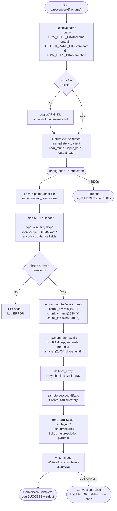

# NG Data Conversion Pipeline & Tracking System

> **Developer:** Tahmeed Ahmad
> **Organisation:** Sudha Gopalakrishnan Brain Centre, IIT MADRAS
> **Version:** 1.1.0
> **Stack:** Python 3.10 · FastAPI · Uvicorn · Dask · OME-Zarr · NumPy · SQLite
> **Last Updated:** June 2026

---

## Table of Contents

1. [Overview](#overview)
2. [Architecture Diagram](#architecture-diagram)
3. [Project Structure](#project-structure)
4. [In-Memory Conversion Tracking & Cache](#in-memory-conversion-tracking--cache)
5. [Control Panel UI Features (Port 10302)](#control-panel-ui-features-port-10302)
6. [Database Dashboard UI Features (Port 10303)](#database-dashboard-ui-features-port-10303)
7. [API Endpoints Reference](#api-endpoints-reference)
8. [Conversion Process Diagram](#conversion-process-diagram)
9. [NRRD / NHDR Header Parsing](#nrrd--nhdr-header-parsing)
10. [Configuration](#configuration)
11. [Installation & Running](#installation--running)
12. [How to Trigger a Conversion](#how-to-trigger-a-conversion)
13. [Requirements](#requirements)

---

## Overview

The **NG Data Conversion Pipeline & Tracking System** is a robust 5-component orchestration backend and UI suite. It manages the conversion of large raw binary volumetric brain scan files (`.raw`) into **OME-Zarr** multiresolution stores for streaming visualisation in **Neuroglancer**, while providing a database-backed job tracker and live monitoring dashboards.

The system coordinates four external/local resources:

| Resource | Address | Role |
|---|---|---|
| **Raw Data Server** | `http://172.20.23.241:10228/` | Hosts unconverted `.raw` + `.nhdr` file pairs |
| **Converted Data Server** | `http://172.20.23.241:10229/` | Hosts finished `.zarr` OME-Zarr stores |
| **Pipeline API** | `http://172.20.23.217:10302/` | FastAPI orchestration backend + Control Panel UI |
| **Pipeline Database** | `http://172.20.23.217:10303/` | FastAPI SQLite job tracker + Dashboard UI |

Key capabilities:
- **Live file listing** from HTTP servers via HTML directory-index parsing.
- **Cross-server status comparison** identifying converted, converting, and pending files.
- **Automatic NHDR metadata parsing** for dynamic volume shape, dtype, and encoding extraction.
- **Background conversion jobs** triggered via API, running non-blocking subprocesses.
- **Thread-safe caching** to prevent API timeouts during heavy multi-gigabyte file streaming.
- **Dual Skeuomorphic / Dark Mode UIs** providing real-time conversion monitoring and database management.

---

## Architecture Diagram

graph TB

    subgraph CLIENTS["Clients"]
        UI_Pipe["Control Panel UI<br>172.20.23.217:10302<br>Skeuomorphic HTML/CSS/JS"]
        UI_Dash["DB Dashboard UI<br>172.20.23.217:10303<br>Dark-mode HTML/CSS/JS"]
    end

    subgraph API_PIPE["Pipeline API · Port 10302"]
        direction TB
        FASTAPI_PIPE["FastAPI<br>(main.py)"]
        CACHE["Thread-Safe Cache<br>_raw_files_cache<br>_active_conversions"]
        BG_PIPE["BackgroundTasks<br>Worker Pool"]
    end

    subgraph API_DB["Database API · Port 10303"]
        FASTAPI_DB["FastAPI<br>(Database-api/main.py)"]
        SQLITE["SQLite DB<br>(pipeline.db)"]
    end

    subgraph RAW_SERVER["Raw Server · Port 10228"]
        RAW_DIR["HTTP Index<br>.raw + .nhdr"]
    end

    subgraph CONV_SERVER["Converted Server · Port 10229"]
        ZARR_DIR["HTTP Index<br>.zarr"]
    end

    subgraph LOCAL_FS["Local Filesystem"]
        RAW_FILES["RAW_FILES_DIR<br>*.raw<br>*.nhdr"]
        OUT_DIR["OUTPUT_ZARR_DIR<br>*.zarr"]
        SCRIPT["raw_converter.py<br>Dask + Zarr Engine"]
    end

    UI_Pipe -->|"Polls /api/files/status"| FASTAPI_PIPE
    UI_Dash -->|"CRUD operations"| FASTAPI_DB
    UI_Dash -->|"POST /api/jobs/{id}/convert"| FASTAPI_DB

    FASTAPI_DB -->|"1. GET /api/files/raw"| FASTAPI_PIPE
    FASTAPI_DB -->|"2. POST /api/convert/{file}"| FASTAPI_PIPE
    FASTAPI_DB -->|"Reads/Writes"| SQLITE

    FASTAPI_PIPE --> CACHE
    FASTAPI_PIPE -->|"Downloads"| RAW_SERVER
    FASTAPI_PIPE -->|"Checks"| CONV_SERVER
    FASTAPI_PIPE --> BG_PIPE

    BG_PIPE -->|"subprocess.run()"| SCRIPT

    SCRIPT -->|"Memmap reads"| RAW_FILES
    SCRIPT -->|"Writes pyramid"| OUT_DIR
---

## Project Structure

```
NG_data_conversion_pipeline/
├── main.py               # FastAPI orchestration API — all endpoints, NHDR parser, background tasks,
│                         # thread-safe conversion tracker, raw-files cache, static file serving
├── raw_converter.py      # Standalone conversion engine — NHDR auto-discovery, np.memmap, Dask, OME-Zarr
├── index.html            # Skeuomorphic control-panel homepage with live JS polling monitor
├── style.css             # Skeuomorphic CSS — metal, CRT, LEDs, rivets
├── favicon.png           # Pipeline favicon
├── requirements.txt
└── Database-api/
    ├── main.py           # Database FastAPI app — SQLite job tracker, conversion trigger proxy
    ├── index.html        # Dark-mode dashboard UI — job table, add form, modals
    ├── pipeline.db       # SQLite database
    └── WorkReport.md     # Developer work report
```

---

## In-Memory Conversion Tracking & Cache

During massive `.raw` file streams, simple downstream HTTP servers (like the Raw Data Server) get saturated and block directory-listing requests, leading to timeouts.

To ensure uninterrupted API responses and UI monitoring, `main.py` implements a robust caching layer:

- `_active_conversions: set` — Tracks filenames currently executing in the background worker. Added when `_run_conversion()` begins; discarded in the `finally` block.
- `_raw_files_cache: List[str]` — Caches the last successful raw directory listing. Seeded with the converting filename and its `.nhdr` *before* the streaming download initiates.
- **Lock Mechanisms:** Both structures are protected by `threading.Lock()` to prevent race conditions.
- **Fallback Behaviour:** If `/api/files/raw` or `/api/files/status` encounter a `502 Bad Gateway` from the saturated raw server, they instantly fall back to the cache and inject the `_active_conversions` state.

---

## Control Panel UI Features (Port 10302)

The main landing page is a highly immersive, skeuomorphic control console.

- **Server Status Row:** 4 interactive cards (Raw Server, Pipeline API, Converted Data Server, Pipeline Database). Each features glowing LED indicators, host:port displays, and action buttons.
- **Pipeline Database Card:** Features an amber LED and a 3-column symmetric layout with engraved metallic dividers.
- **Live Conversion Monitor:** A central intelligence panel that polls `/api/files/status` every 10 seconds. It dynamically shifts between 3 states:
  - **STATE 1 (converting):** Shows active files with an amber progress bar sweep, a cycling phase label (e.g., `NHDR SIDECAR DOWNLOAD` → `CHUNK MATRIX COMPUTE`), and a live `HH:MM:SS` elapsed clock.
  - **STATE 2 (pending):** Displays `FILES QUEUED — AWAITING CONVERSION TRIGGER` with a dimmed amber LED when files exist on the server but are not processing.
  - **STATE 3 (idle):** Displays `ALL FILES CONVERTED — PIPELINE IDLE` with a pulsing green LED.
- **Monitor File Rows:** Individual files show explicit states: `CONVERTING` (🔴 blinking amber dot), `QUEUED` (⏳ grey text), or `CONVERTED` (✔ green check).
- **CRT Monitors:** Twin iframe panels rendering real-time `raw` and `converted` API data, plus a full-width `status` cross-check panel.
- **Conversion Control Station:** Features LCD endpoint URL readouts, key-value data displays, and direct links to metadata fetching and Swagger.
- **Skeuomorphic Info Modal:** A stylish slide-down instruction manual overlay.

---

## Database Dashboard UI Features (Port 10303)

The Database API serves a premium dark-themed management dashboard.

- **Pipeline Monitor Banner:** Always-visible top banner linking back to the Control Panel (`10302`) with a live green indicator dot.
- **Job Table:** Rich data grid displaying: ID, Brain Name, State (`pending conversion` / `processing` / `converted`), Date Processed, Algorithm, Version, URL, and Actions.
- **Action Buttons:**
  - `Convert` (Purple): Initiates the intelligent file-matching proxy to trigger actual data conversion.
  - `Edit URL` (Amber): Opens a prompt to manually update the Neuroglancer URL path.
  - `Cycle State` (Green): Manually rotates the job status.
  - `Delete` (Red): Removes the job from the DB.
- **Add Job Form:** Integrated form for registering new brain scans into the system.
- **Instruction Modal:** First-visit onboarding modal (state saved in `localStorage`).
- **Auto-Sorting:** Ensures active `processing` jobs remain at the top, pushing `converted` jobs to the bottom.

---

## API Endpoints Reference

### Pipeline API (`http://172.20.23.217:10302`)

| Method | Path | Tag | Description | Returns |
|---|---|---|---|---|
| `GET` | `/` | — | Skeuomorphic HTML control panel | `text/html` |
| `GET` | `/api/files/raw` | Files | List files on the raw server. **Filtered to `.raw` and `.nhdr` only. Falls back to cache during active downloads.** | `{"raw_files": [...]}` |
| `GET` | `/api/files/converted` | Files | List all files on the converted server | `{"converted_files": [...]}` |
| `GET` | `/api/files/status` | Files | Cross-server status. **Filtered to `.raw` only. Returns `converting` for in-flight jobs. Falls back to cache when raw server is busy.** | `[{"filename", "status", "converted_url?"}]` |
| `GET` | `/api/files/metadata/{file}`| Files | Parse NHDR for a raw file | `NhdrMetadata` object |
| `POST` | `/api/convert/{file}` | Conversion | Trigger background conversion | `202 {"status":"processing", ...}` |

### Database API (`http://172.20.23.217:10303/api/jobs/`)

| Method | Path | Description |
|---|---|---|
| `GET` | `/api/jobs/` | List all tracked jobs |
| `POST` | `/api/jobs/` | Add a new job to the tracker |
| `PUT` | `/api/jobs/{id}` | Update job metadata (state, URL, date, algorithm) |
| `DELETE` | `/api/jobs/{id}` | Delete a job from the tracker |
| `POST` | `/api/jobs/{id}/convert`| Triggers pipeline conversion for a job. Auto-matches the brain name to the exact `.raw` file (prioritising `_new`), updates DB to `processing`, and proxies to the Pipeline API. |

### Error Responses

| Code | When |
|---|---|
| `502 Bad Gateway` | Remote file server is unreachable. *(Note: `/api/files/raw` and `/api/files/status` now catch 502s and return cached data instead when the server is busy converting).* |
| `404 Not Found` | No `.nhdr` sidecar file found. |
| `422 Unprocessable` | `.nhdr` exists but contains malformed fields. |

---

## Conversion Process Diagram



---

## NRRD / NHDR Header Parsing

Each `.raw` binary file is paired with a `.nhdr` NRRD detached header file of the same stem. Example:

```
NRRD0004
type: unsigned char
dimension: 3
space: left-posterior-superior
sizes: 20000 20000 706
space directions: (0,-0.004,0) (0,0,-0.004) (0.06,0,0)
kinds: domain domain domain
encoding: raw
space origin: (0,0,0)
data file: 142_2dwarp_img_4mpp_new.raw
```

**Parsed results:**

| Field | Raw value | Interpreted as |
|---|---|---|
| `type` | `unsigned char` | `numpy.dtype('uint8')` |
| `sizes` | `20000 20000 706` | NRRD X,Y,Z order |
| numpy shape | reversed | `(706, 20000, 20000)` — Z,Y,X |
| auto chunks | computed | `(16, 2048, 2048)` |

> [!IMPORTANT]
> The `sizes` field in NRRD is always **fastest-axis-first** `(X, Y, Z)`. NumPy requires **slowest-axis-first** `(Z, Y, X)`. The parsers handle this reversal automatically.

---

## Configuration

Configuration is located at the top of `main.py`.

```python
# Remote servers
RAW_SERVER_URL       = "http://172.20.23.241:10228/"
CONVERTED_SERVER_URL = "http://172.20.23.241:10229/"

# Local paths
RAW_FILES_DIR   = "/home/tahmeed/nvIndexViewer/brainStem"
OUTPUT_ZARR_DIR = "/home/tahmeed/nvIndexViewer/converted"

# Defaults
PYRAMID_LEVELS = 4
HTTP_TIMEOUT   = 10.0
```

---

## Installation & Running

```bash
# 1. Clone & install
cd NG_data_conversion_pipeline
pip install -r requirements.txt

# 2. Start Pipeline API
uvicorn main:app --host 0.0.0.0 --port 8002 --reload

# 3. Start Database API
cd Database-api
uvicorn main:app --host 0.0.0.0 --port 8003 --reload
```

---

## How to Trigger a Conversion

### Option A — Database Dashboard (Recommended)
1. Navigate to `http://172.20.23.217:10303/`
2. Click **Convert** on any pending job row.

### Option B — Pipeline Swagger UI
1. Navigate to `http://172.20.23.217:10302/docs`
2. Use the `POST /api/convert/{filename}` endpoint directly.

---

## Requirements

```
fastapi>=0.111.0
uvicorn[standard]>=0.29.0
httpx>=0.27.0
beautifulsoup4>=4.12.3
pydantic>=2.7.0
numpy>=1.26.0
dask[array]>=2024.1.0
zarr>=2.18.0
ome-zarr>=0.9.0
sqlalchemy>=2.0.0
```
