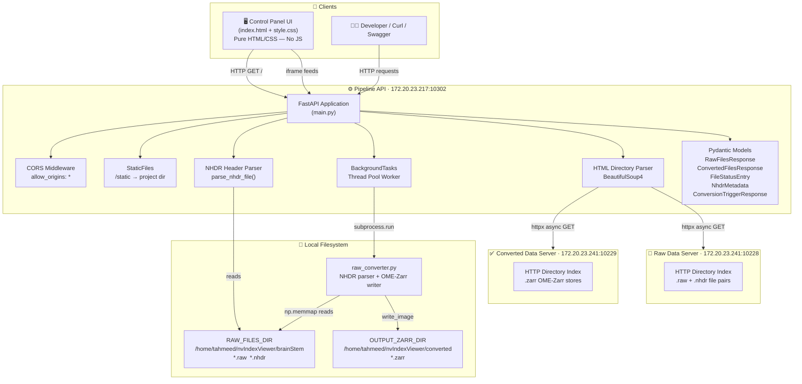
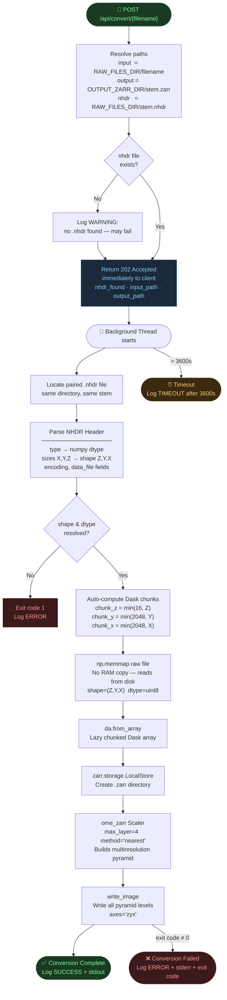
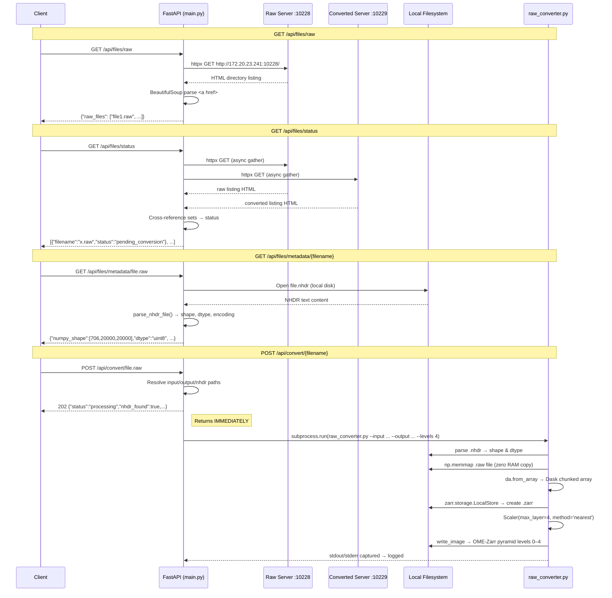

# NG Data Conversion Pipeline

> **Developer:** Tahmeed Ahmad
> **Version:** 1.0.0
> **Stack:** Python 3.10 · FastAPI 0.136 · Uvicorn · Dask · OME-Zarr · NumPy

---

## Table of Contents

1. [Overview](#overview)
2. [Architecture Diagram](#architecture-diagram)
3. [Conversion Process Diagram](#conversion-process-diagram)
4. [API Request Flow Diagram](#api-request-flow-diagram)
5. [Project Structure](#project-structure)
6. [Components](#components)
   - [main.py — FastAPI Backend](#mainpy--fastapi-backend)
   - [raw_converter.py — Conversion Engine](#raw_converterpy--conversion-engine)
   - [index.html + style.css — Control Panel UI](#indexhtml--stylecss--control-panel-ui)
7. [API Endpoints Reference](#api-endpoints-reference)
8. [NRRD / NHDR Header Parsing](#nrrd--nhdr-header-parsing)
9. [Configuration](#configuration)
10. [Installation & Running](#installation--running)
11. [How to Trigger a Conversion](#how-to-trigger-a-conversion)
12. [Requirements](#requirements)

---

## Overview

The **NG Data Conversion Pipeline** is a FastAPI-based orchestration and monitoring backend that manages the conversion of large raw binary volumetric brain scan files (`.raw`) into **OME-Zarr** multiresolution stores suitable for streaming visualisation in **Neuroglancer**.

The system coordinates three external resources:

| Resource | Address | Role |
|---|---|---|
| **Raw Data Server** | `http://172.20.23.241:10228/` | Hosts unconverted `.raw` + `.nhdr` file pairs |
| **Converted Data Server** | `http://172.20.23.241:10229/` | Hosts finished `.zarr` OME-Zarr stores |
| **Pipeline API** | `http://172.20.23.217:10302/` | This FastAPI backend — orchestrates everything |

Key capabilities:
- **Live file listing** from both HTTP servers via HTML directory-index parsing
- **Cross-server status comparison** — identifies which raw files are already converted
- **Automatic NHDR metadata parsing** — reads `.nhdr` sidecar headers to dynamically extract volume shape, dtype, and encoding for every file
- **Background conversion jobs** — `POST /api/convert/{filename}` triggers `raw_converter.py` as a non-blocking subprocess and returns `202 Accepted` immediately
- **Skeuomorphic control-panel UI** — a pure HTML/CSS homepage served at `/` with live iframe feeds of all API endpoints

---

## Architecture Diagram



---

## Conversion Process Diagram



---

## API Request Flow Diagram



---

## Project Structure

```
NG_data_conversion_pipeline/
│
├── main.py               # FastAPI application — all API endpoints, NHDR parser,
│                         # background task runner, static file serving
│
├── raw_converter.py      # Standalone conversion engine
│                         # NHDR auto-discovery · np.memmap · Dask · OME-Zarr writer
│
├── index.html            # Skeuomorphic control-panel homepage (pure HTML, no JS)
│                         # Served at GET / by FastAPI
│
├── style.css             # Full skeuomorphic CSS
│                         # Served at GET /static/style.css by FastAPI StaticFiles
│
└── requirements.txt      # Python dependencies
```

---

## Components

### `main.py` — FastAPI Backend

The central orchestration layer. Key responsibilities:

#### Configuration Block (top of file)

| Variable | Default | Description |
|---|---|---|
| `RAW_SERVER_URL` | `http://172.20.23.241:10228/` | Remote raw data HTTP server |
| `CONVERTED_SERVER_URL` | `http://172.20.23.241:10229/` | Remote converted data HTTP server |
| `CONVERSION_SCRIPT` | `raw_converter.py` (auto-resolved) | Absolute path to the conversion script |
| `RAW_FILES_DIR` | `/home/tahmeed/nvIndexViewer/brainStem` | Local directory containing `.raw` + `.nhdr` pairs |
| `OUTPUT_ZARR_DIR` | `/home/tahmeed/nvIndexViewer/converted` | Local directory where `.zarr` stores are written |
| `PYRAMID_LEVELS` | `4` | Number of OME-Zarr downsampling levels |
| `HTTP_TIMEOUT` | `10.0` seconds | Timeout for fetching remote directory listings |

#### Internal Helpers

| Function | Purpose |
|---|---|
| `_parse_directory_listing(html)` | BeautifulSoup parser for HTTP autoindex pages (works with Python `http.server`, Nginx, Apache) |
| `_fetch_file_list(server_url)` | Async httpx fetcher — raises `HTTPException(502)` on network/server errors |
| `_parse_nhdr_file(nhdr_path)` | NRRD header parser — extracts shape, dtype, encoding, data_file |
| `_run_conversion(filename)` | Background task — resolves paths, calls `raw_converter.py` via subprocess, logs all output |

---

### `raw_converter.py` — Conversion Engine

A fully self-contained CLI script that can be called standalone or from the API.

#### Auto-Discovery Logic

When `--input file.raw` is provided, the script automatically looks for `file.nhdr` in the same directory. If found, volume parameters are parsed from it. CLI flags (`--shape`, `--dtype`, `--chunks`) can override any parsed value.

#### Priority Order for Parameters

```
CLI flag  >  .nhdr parsed value  >  error (required — no defaults for shape/dtype)
```

#### NHDR → NumPy Shape Conversion

NRRD stores dimensions in fastest-axis-first order `(X, Y, Z)`. NumPy/C-order requires slowest-axis-first `(Z, Y, X)`.

```
NHDR:   sizes: 20000 20000 706   →  (X=20000, Y=20000, Z=706)
NumPy:  shape = tuple(reversed) →  (Z=706,   Y=20000, X=20000)
```

#### Supported NRRD Dtype Strings

| NHDR `type` field | NumPy dtype |
|---|---|
| `unsigned char`, `uchar`, `uint8` | `uint8` |
| `unsigned short`, `ushort`, `uint16` | `uint16` |
| `unsigned int`, `uint`, `uint32` | `uint32` |
| `short`, `int16` | `int16` |
| `int`, `int32` | `int32` |
| `float` | `float32` |
| `double` | `float64` |

#### Chunk Auto-Computation

```python
chunk_z = min(16,   Z)    # keeps Z slices manageable
chunk_y = min(2048, Y)    # 2K tile in Y
chunk_x = min(2048, X)    # 2K tile in X
```

#### CLI Usage

```bash
# Auto-reads paired .nhdr (recommended)
python3 raw_converter.py \
  --input  /data/brainStem/142_2dwarp_img_4mpp_new.raw \
  --output /data/converted/142_2dwarp_img_4mpp_new.zarr

# With explicit overrides
python3 raw_converter.py \
  --input  /data/brainStem/file.raw \
  --output /data/converted/file.zarr \
  --shape  706,20000,20000 \
  --dtype  uint8 \
  --chunks 16,2048,2048 \
  --levels 4
```

---

### `index.html` + `style.css` — Control Panel UI

A **pure HTML/CSS** skeuomorphic dashboard — zero JavaScript. Served by FastAPI at `GET /`.

**Served at:** `http://172.20.23.217:10302/`

#### UI Sections

| Section | Content |
|---|---|
| **Brushed Aluminium Header** | Pipeline name, pulsing LED indicators, corner rivets |
| **Server Status Row** | Three server cards (Raw → API → Converted) with large LED indicators, host:port display, and direct server browse buttons |
| **Raw Files Monitor** | CRT-style iframe panel showing live `GET /api/files/raw` feed |
| **Converted Files Monitor** | CRT-style iframe panel showing live `GET /api/files/converted` feed |
| **Status Overview Monitor** | Full-width CRT panel showing live `GET /api/files/status` cross-server comparison |
| **Conversion Control Station** | LCD readout display, key-value readout panel, metadata check button, Swagger trigger button |
| **API Endpoint Console** | Physical button grid linking to all seven API endpoints |
| **Footer** | Version info, rivet details |

#### CSS Skeuomorphic Techniques

| Effect | CSS Technique |
|---|---|
| Brushed metal | `repeating-linear-gradient` horizontal striations |
| 3D panel depth | Multi-layer `box-shadow` (outer bevel + groove + drop) |
| Sunken insets | `box-shadow: inset` with high opacity |
| LED glow | `radial-gradient` bulb + `box-shadow` outer glow + `@keyframes` pulse |
| Embossed text | `background-clip: text` metallic gradient |
| CRT scanlines | `repeating-linear-gradient` overlay pseudo-element |
| Glass glare | Semi-transparent `linear-gradient` positioned div |
| Push buttons | `transform: translateY(2px)` on `:active` + depth shadow collapse |
| Rivets | `radial-gradient` sphere illusion |

---

## API Endpoints Reference

| Method | Path | Tag | Description | Returns |
|---|---|---|---|---|
| `GET` | `/` | — | Skeuomorphic HTML homepage | `text/html` |
| `GET` | `/api/files/raw` | Files | List all files on the raw server | `{"raw_files": [...]}` |
| `GET` | `/api/files/converted` | Files | List all files on the converted server | `{"converted_files": [...]}` |
| `GET` | `/api/files/status` | Files | Cross-server status per raw file | `[{"filename", "status", "converted_url?"}]` |
| `GET` | `/api/files/metadata/{filename}` | Files | Parse NHDR for a raw file | `NhdrMetadata` object |
| `POST` | `/api/convert/{filename}` | Conversion | Trigger background conversion | `202 {"status":"processing", ...}` |
| `GET` | `/health` | Health | Liveness probe | `{"status":"healthy"}` |
| `GET` | `/docs` | — | Swagger interactive UI | `text/html` |
| `GET` | `/redoc` | — | ReDoc API reference | `text/html` |

### Error Responses

| Code | When |
|---|---|
| `502 Bad Gateway` | Remote file server (`:10228` or `:10229`) is unreachable or returns non-2xx |
| `404 Not Found` | No `.nhdr` sidecar file found for the requested filename |
| `422 Unprocessable Entity` | `.nhdr` file exists but contains malformed or unknown fields |

---

## NRRD / NHDR Header Parsing

Each `.raw` binary file is paired with a `.nhdr` NRRD detached header file of the same stem. Example:

```
# File: 142_2dwarp_img_4mpp_new.nhdr

NRRD0004
type: unsigned char
dimension: 3
space: left-posterior-superior
sizes: 20000 20000 706
space directions: (0,-0.004,0) (0,0,-0.004) (0.06,0,0)
kinds: domain domain domain
encoding: raw
space origin: (0,0,0)
data file: 142_2dwarp_img_4mpp_new.raw
```

**Parsed results for the above:**

| Field | Raw value | Interpreted as |
|---|---|---|
| `type` | `unsigned char` | `numpy.dtype('uint8')` |
| `sizes` | `20000 20000 706` | NRRD X,Y,Z order |
| numpy shape | reversed | `(706, 20000, 20000)` — Z,Y,X |
| `encoding` | `raw` | Direct binary read |
| auto chunks | computed | `(16, 2048, 2048)` |

> [!IMPORTANT]
> The `sizes` field in NRRD is always in **fastest-axis-first** order `(X, Y, Z)`.
> NumPy requires **slowest-axis-first** `(Z, Y, X)`.
> The parsers in both `main.py` and `raw_converter.py` handle this reversal automatically.

---

## Configuration

All configuration lives at the **top of `main.py`**. No `.env` file is required for basic operation.

```python
# Remote servers
RAW_SERVER_URL       = "http://172.20.23.241:10228/"
CONVERTED_SERVER_URL = "http://172.20.23.241:10229/"

# Local paths  ← UPDATE THESE for your system
RAW_FILES_DIR  = "/home/tahmeed/nvIndexViewer/brainStem"
OUTPUT_ZARR_DIR = "/home/tahmeed/nvIndexViewer/converted"

# Conversion defaults
PYRAMID_LEVELS = 4     # OME-Zarr pyramid downsampling levels
HTTP_TIMEOUT   = 10.0  # Seconds before server fetch times out
```

> [!TIP]
> If converted filenames differ from raw filenames (e.g. a suffix is appended), update the `is_converted` check inside `file_status()` in `main.py`:
> ```python
> is_converted = f"{stem}_converted.zarr" in converted_set
> ```

---

## Installation & Running

### 1. Clone / enter the project directory

```bash
cd NG_data_conversion_pipeline
```
### 2. Create Virtual environment(optional)
```bash
python3.12 -m venv venv
#python version must be more than 3.11
source venv/bin/activate
```

### 3. Install dependencies

```bash
pip install -r requirements.txt
```

### 4. Start the API server

```bash
uvicorn main:app --host 0.0.0.0 --port 8002 --reload
```

| Flag | Purpose |
|---|---|
| `--host 0.0.0.0` | Listen on all interfaces (required for network access) |
| `--port 10302` | Port number |
| `--reload` | Auto-restart on file changes (development only) |

### 4. Open the control panel

Navigate to: **`http://172.20.23.217:10302/`**

Or the Swagger UI: **`http://172.20.23.217:10302/docs`**

---

## How to Trigger a Conversion

### Option A — Swagger UI (recommended for one-off)

1. Open `http://172.20.23.217:10302/docs`
2. Expand `POST /api/convert/{filename}`
3. Click **Try it out**
4. Enter the filename, e.g. `142_2dwarp_img_4mpp_new.raw`
5. Click **Execute**
6. You will receive a `202 Accepted` response immediately

### Option B — curl

```bash
curl -X POST "http://172.20.23.217:10302/api/convert/142_2dwarp_img_4mpp_new.raw"
```

### Option C — Verify metadata first, then convert

```bash
# Step 1: Check NHDR metadata
curl http://172.20.23.217:10302/api/files/metadata/142_2dwarp_img_4mpp_new.raw

# Step 2: Trigger conversion
curl -X POST http://172.20.23.217:10302/api/convert/142_2dwarp_img_4mpp_new.raw
```

### Monitor conversion progress

Conversion logs stream to the uvicorn console. Look for:

```
[CONVERSION] ▶  Starting: 142_2dwarp_img_4mpp_new.raw
[CONVERSION] Command: python3 /path/raw_converter.py --input ... --output ... --levels 4
[CONVERSION] ✅ Completed: 142_2dwarp_img_4mpp_new.raw
```

> [!WARNING]
> Large volumes (e.g. 20000×20000×706 at uint8) will take significant time and disk space. The subprocess timeout is set to **3600 seconds (1 hour)**. Adjust `timeout=3600` in `_run_conversion()` inside `main.py` if needed.

---

## Requirements

```
fastapi>=0.111.0
uvicorn[standard]>=0.29.0
httpx>=0.27.0
beautifulsoup4>=4.12.3
pydantic>=2.7.0
numpy>=1.26.0
dask[array]>=2024.1.0
zarr>=2.18.0
ome-zarr>=0.9.0
```

---

## Developer

**Tahmeed Ahmad**

*NG Data Conversion Pipeline — Orchestration & Monitoring Backend*
*Built with FastAPI · Dask · OME-Zarr · Pure HTML/CSS Skeuomorphic UI*
